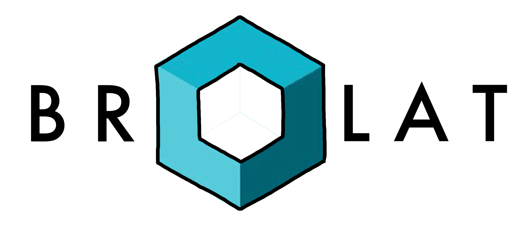

## Introduction

Hi there! We are five students from the University of Zurich. As part of the module "Software Computer Engineering Lab" we were instructed to create an application. In order to learn how to implement a server/client-architecture, we had to integrate a collaborative feature as well as to include an external API.  

During the first couple of weeks of our studies, the members of our group recognized, that it is often overwhelming to get a hold of all the deadlines from the different modules we booked. We think all this energy of planning the semester could be simplified. For this reason, we want to build an interactive application, where users can communicate with each other in small groups and handle all their personal or shared tasks in a simple and intuitive way. Information about various modules, tasks you need to work on and collaborations with other students is centralized in one application. A well designed homepage delivers all the information you need to know about the current week lectures, tasks, exercises, deadlines and meetings that are coming up.

## Technologies used
- [React](https://reactjs.org/) as our frontend - see further information in our [client repository](https://github.com/sopra-fs21-group-09/sopra-fs21-group-09-client)
- [Spring Boot](https://spring.io/) as our backend
- [JPA/Hibernate](https://hibernate.org/orm/documentation/5.4/) for persistence
- [Sonarqube](https://www.sonarqube.org/) to check our source-code quality

## How does our backend work?

Our backend follows the principles of a RESTful API. We aim to supply all functionalities our frontend needs to provide a user friendly and versatile application. Those functionalities include: User creation and editing, joining modules or groups, creating tasks and many more. 
On startup, the backend communicates with the database of the University of Zurich to load the relevant modules (currently "Wirtschaftsinformatik" lectures, could be extended but is currently kept simple to minimize data transfer). It furthermore provides all the endpoints our client needs. The requests to our server are handled in the controller classes, each having their own responsibilities. The corresponding services are responsible for the needed functionalities. Every data manipulation is saved in the correlated repository. To reduce database transactions and to make up for our less successful "Database Systems"-midterm, we extended the repository with some tables to keep track of completed tasks and User-Group / Module-Group / User-Module relations.

## Further functionalities

We also added some features next to the functionalities our frontend is currently depending on. The ability to add subtasks to tasks is one of them. 
Furthermore, there's also a branch with working authentication with JWT Tokens.

## How to launch the backend

### Get your IDE of choice

Download your IDE of choice: (e.g., [Eclipse](http://www.eclipse.org/downloads/), [IntelliJ](https://www.jetbrains.com/idea/download/)), [Visual Studio Code](https://code.visualstudio.com/) and make sure Java 15 is installed on your system (for Windows-users, please make sure your JAVA_HOME environment variable is set to the correct version of Java).

1. File -> Open... -> SoPra Server Template
2. Accept to import the project as a `gradle project`

To build right click the `build.gradle` file and choose `Run Build`

### Building with Gradle

You can use the local Gradle Wrapper to build the application.

Plattform-Prefix:

-   MAC OS X: `./gradlew`
-   Linux: `./gradlew`
-   Windows: `./gradlew.bat`

More Information about [Gradle Wrapper](https://docs.gradle.org/current/userguide/gradle_wrapper.html) and [Gradle](https://gradle.org/docs/).

#### Build

`./gradlew build`

#### Run

`./gradlew bootRun`

#### Test

`./gradlew test`

#### Development Mode

You can start the backend in development mode, this will automatically trigger a new build and reload the application
once the content of a file has been changed and you save the file.

Start two terminal windows and run:

`./gradlew build --continuous`

and in the other one:

`./gradlew bootRun`

If you want to avoid running all tests with every change, use the following command instead:

`./gradlew build --continuous -xtest`

## API Endpoint Testing

### Postman

-   We highly recommend to use [Postman](https://www.getpostman.com) in order to test your API Endpoints.

## Authors and acknowledgment

### Backend developers
- [Loris De Luca](https://github.com/DeLucaL), University of Zurich 
- [Robin Wassink](https://github.com/RobinWassink), University of Zurich

# License
MIT License

Copyright (c) 2021-present [Loris De Luca, Robin Wassink]

Permission is hereby granted, free of charge, to any person obtaining a copy
of this software and associated documentation files (the "Software"), to deal
in the Software without restriction, including without limitation the rights
to use, copy, modify, merge, publish, distribute, sublicense, and/or sell
copies of the Software, and to permit persons to whom the Software is
furnished to do so, subject to the following conditions:

The above copyright notice and this permission notice shall be included in all
copies or substantial portions of the Software.

THE SOFTWARE IS PROVIDED "AS IS", WITHOUT WARRANTY OF ANY KIND, EXPRESS OR
IMPLIED, INCLUDING BUT NOT LIMITED TO THE WARRANTIES OF MERCHANTABILITY,
FITNESS FOR A PARTICULAR PURPOSE AND NONINFRINGEMENT. IN NO EVENT SHALL THE
AUTHORS OR COPYRIGHT HOLDERS BE LIABLE FOR ANY CLAIM, DAMAGES OR OTHER
LIABILITY, WHETHER IN AN ACTION OF CONTRACT, TORT OR OTHERWISE, ARISING FROM,
OUT OF OR IN CONNECTION WITH THE SOFTWARE OR THE USE OR OTHER DEALINGS IN THE
SOFTWARE.
